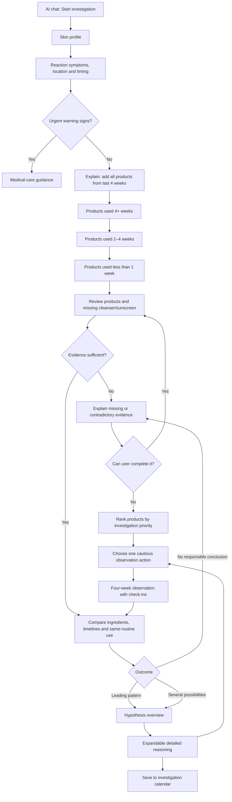

# LUX UX Flow — AI Wireframe Generation Brief

## Task

Create low-fidelity, editable mobile wireframes for **LUX**, an AI-guided skincare investigation tool. The experience helps a user examine whether products or ingredient combinations may be associated with a recorded skin reaction.

Do not create polished UI, branding, final colors, illustrations, or marketing screens. Focus on information architecture, interaction states, decision points, and navigation. Use simple grayscale components and realistic placeholder content.

## Product principles

- LUX investigates patterns; it does not diagnose allergies or medical conditions.
- The AI should explain why it asks each question, but keep messages short.
- Collect only information that can change the analysis.
- Ask the user to include **all products used during the last four weeks**, not only products they suspect.
- Treat tolerated products as counter-evidence.
- Keep uncertain histories visible, but do not treat them as proof.
- Explain possible ingredient interactions as hypotheses, not proven causes.
- Always show evidence, limitations, and the next cautious action.
- Use progressive disclosure: the main result is simple; detailed evidence appears in expandable sections.

## Platform and layout

- Mobile-first app wireframes, 402 × 874 px.
- AI chat is the primary interaction pattern.
- Use chat bubbles for AI explanations and questions.
- Use structured UI controls inside the conversation: choice chips, selectable cards, search, camera input, date fields, checkboxes, accordions, and sticky bottom actions.
- Show one main decision per screen.
- Include Back, Save and exit, progress indication, and accessible labels.
- Generate each numbered screen and the important alternate states listed below.

## UX vocabulary

Use:

- Associated with this reaction
- Used without problems
- Not enough history
- Possible contributor
- Possible interaction
- Fits your recorded pattern
- Evidence for
- Evidence against
- Not enough evidence yet
- Investigation priority

Avoid:

- This caused your reaction
- Allergy diagnosis
- Toxic ingredient
- Dangerous product
- Safe for you
- Guaranteed result
- Highest-risk product

## Primary user flow

### 01 — Start investigation

**Purpose:** Establish expectations before collecting information.

**Screen content:**

- AI greeting: “What is currently happening to your skin?”
- Short explanation: LUX compares product timelines, ingredients, tolerated products, and possible same-routine interactions.
- Disclaimer: “This investigation is not a medical diagnosis.”
- Primary action: **Start investigation**
- Secondary action: **Continue saved investigation**, shown only if one exists

### 02 — Skin profile

#### 02A — Skin type

Ask: “Which description fits your skin most often?”

Single-select options:

- Dry
- Combination
- Oily
- Normal or balanced
- Not sure

#### 02B — Skin tendencies

Ask: “Do any of these usually apply?”

Multi-select options:

- Sensitive
- Acne-prone
- None
- Not sure

#### 02C — Known conditions

Make this optional and separate from skin type.

Multi-select options:

- Rosacea
- Eczema
- Perioral dermatitis
- Psoriasis
- Other
- None
- Prefer not to say

**UX rule:** Later explanations may use this profile as context, but must not claim that skin type proves causation. For example: “Because you recorded sensitive skin, stinging may be more relevant to your investigation,” rather than “Sensitive skin caused this reaction.”

### 03 — Describe the reaction

#### 03A — Observable symptoms

Ask: “What did you notice?” Allow multiple selections.

- Redness or change in skin colour
- Itching
- Burning or stinging
- Dryness or tightness
- Flaking or scaling
- Small rash-like bumps
- Whiteheads or pimples
- Swelling
- Blisters, weeping, or crusting
- Other

#### 03B — Location

Use a selectable face map plus a text alternative:

- Whole face
- Forehead
- Cheeks
- Eye area
- Nose
- Around mouth
- Chin or jaw
- Neck
- Other

#### 03C — Timing

Collect:

- Approximate start date
- How quickly symptoms appeared: minutes/hours, next day, 2–3 days later, more than 3 days later, not sure
- Current status: ongoing, improving, resolved, getting worse

#### 03D — Details

- Optional free-text field: “Tell LUX anything else you noticed.”
- Optional reaction photo

#### 03E — Safety branch

If the user reports breathing difficulty; swelling of lips, tongue, or throat; major eye involvement; widespread rash; severe pain; extensive blistering/open skin; infection signs; or rapidly worsening symptoms, interrupt the normal flow. Show urgent-care guidance and do not continue product analysis as if it were sufficient medical help.

### 04 — Add all products used in the last four weeks

**AI explanation:**

“Please include every product used on the affected area during the last four weeks—even products you have used without problems. Those products help LUX rule out weaker explanations.”

Show a simple three-section collection flow. Do not ask the user to assign a routine role or category.

#### 04A — Products used for 4 weeks or longer

- Brief helper text: “Long-term products can show what your skin may already tolerate.”
- Product cards already added
- **Add product** action
- **None** action
- Continue to next duration group

#### 04B — Products used for 1–4 weeks

- Helper text: “Recently introduced products may help explain the timing.”
- Product cards already added
- **Add product** action
- **None** action
- Continue to next duration group

#### 04C — Products used for less than 1 week

- Helper text: “Very recent products may be relevant, depending on when the reaction began.”
- Product cards already added
- **Add product** action
- **None** action
- Continue to review

**Duration rule:** These ranges must be mutually exclusive and collectively complete. If the product start date is known, LUX assigns the group automatically. If not, the user selects the closest range or “Not sure.”

#### 04D — Add product modal or conversational step

Offer only two primary methods:

1. **Search by name**
   - Search field with brand/product autocomplete
   - Select exact product from results
   - Confirm correct version or packaging if multiple formulas exist
2. **Take photos**
   - First photo: product front
   - Second photo when necessary: ingredient list
   - AI proposes a match
   - User must confirm or correct the match

After identifying a product, ask only:

- When did you start using it? Exact date, approximate duration, or not sure
- How often was it used? Daily, several times weekly, once/occasionally, or not sure
- Was it used on or near the affected area? Yes, no, or not sure

Then return immediately to the duration group. Do **not** ask for routine role.

#### 04E — Product review

Show all added products grouped by duration. Each product card includes:

- Product name and thumbnail
- Duration
- Frequency
- Data status: exact formula confirmed, possible formula mismatch, or ingredient list incomplete
- Edit/remove action

AI asks: “Is anything missing—including cleanser, sunscreen, makeup, prescription treatment, masks, or spot treatments?”

Allow:

- Add missing product
- Confirm nothing else was used
- Continue to analysis

### 05 — Evidence preparation

LUX automatically derives an evidence state from the recorded timeline and then asks for confirmation only where necessary:

- Associated with this reaction
- Used without problems
- Not enough history

Do not force the user to label every product suspicious or safe. Show a compact confirmation list only when the AI's interpretation is ambiguous.

Before analysis, check:

- At least one relevant product exists
- Cleanser and sunscreen were added or explicitly confirmed as not used
- Product identity and ingredient data are sufficiently complete
- Timelines can be compared
- There is useful positive evidence, negative evidence, or both

If information is missing, say exactly what is missing and return the user to the relevant step.

### 06 — Analysis in progress

Show a transparent progress state with short, non-technical steps:

1. Comparing when each product was introduced
2. Finding ingredients shared by products associated with the reaction
3. Checking those ingredients against longer-tolerated products
4. Checking for potentially irritating combinations used within the same routine or period
5. Considering the recorded skin type, tendencies, symptoms, and timing
6. Checking ingredient-data limitations and formula uncertainty

Do not imply laboratory-level certainty.

## Analysis model to communicate through the UI

The interface should distinguish two hypothesis types:

### A. Single-ingredient pattern

An ingredient appears across products associated with the reaction and is absent—or less supported—in products used without problems.

### B. Possible same-routine interaction

Two or more ingredients/products may increase irritation potential when layered or used too frequently in the same period. Examples may include multiple exfoliating acids, retinoid plus strong exfoliation, or several drying/irritating treatments. These are context-dependent possibilities, not universal incompatibilities.

For every hypothesis, the analysis must consider:

- Product introduction and reaction timing
- Frequency and likely overlap in use
- Products used without problems
- Ingredient concentration being unknown or unavailable
- Formulation, pH, skin-barrier condition, and dose as limitations
- User's recorded skin type and tendencies
- Whether a known skin condition makes generic advice inappropriate

Never infer an interaction from ingredient names alone without showing uncertainty. Never claim that two ingredients chemically “clashed” unless supported by reliable formulation data. Prefer “may have increased irritation when used in the same period.”

### 07 — Result overview

Provide one of three outcomes:

1. **Leading hypothesis found**
2. **Several possible explanations remain**
3. **Not enough evidence for a responsible conclusion**

For a leading hypothesis, show:

- Plain-language summary: “This currently fits your recorded pattern best.”
- Hypothesis type: possible ingredient contributor or possible same-routine interaction
- Products involved
- Short explanation connecting timeline, symptoms, use frequency, and skin profile
- Cautious confidence label: stronger pattern, possible pattern, or weak pattern
- Primary action: **See the reasoning**
- Secondary actions: **Save result**, **Choose next action**

Do not show a scientific-looking percentage.

### 08 — Detailed reasoning

Use expandable accordions in this order:

1. **Why this may be relevant**
   - Supporting products and ingredient overlap
   - Timeline match
   - Frequency or same-period usage
2. **How your skin profile was considered**
   - Explain relevance of dry/oily/combination skin, sensitivity, acne tendency, or recorded conditions without treating them as proof
3. **Possible same-routine interactions**
   - Show the product pair/group
   - Explain what may increase irritation
   - State that actual concentration and formulation may be unknown
4. **Evidence against this explanation**
   - Tolerated products containing the candidate ingredient
   - Timing inconsistencies
5. **Uncertain or excluded evidence**
   - Unconfirmed product version
   - Incomplete ingredient list
   - Unclear use history
6. **What could change this result**
   - Missing products, improved dates, or observation outcome

Persistent actions:

- Save result
- Choose a cautious next action
- Edit product history

### 09 — Save to investigation calendar

Saving creates a calendar entry containing:

- Reaction start date and symptoms
- Products recorded
- Current hypothesis and reasoning summary
- Product selected for an observation pause, if any
- Observation start and planned review date
- Optional symptom/photo check-ins

Show a confirmation and a calendar preview. Label this an **investigation record**, not a diagnosis.

### 10 — Cautious next action

LUX proposes one product to pause and observe, based on the strongest timeline match, limited tolerated history, usage overlap, and current hypothesis.

Display:

- Product name
- Why it was selected
- Suggested four-week observation period
- What to keep stable in the rest of the routine
- Confirm pause and create observation entry
- Choose a different product
- Consult a professional instead

Do not recommend pausing prescribed treatment. Do not recommend stopping sunscreen without an appropriate protection plan. These cases need a separate warning and professional guidance route.

### 11 — No-conclusion route

Explain the exact reason, such as:

- Missing cleanser or sunscreen information
- No products with meaningful tolerated history
- Ingredient lists incomplete
- Product versions unconfirmed
- Timeline too uncertain
- Evidence contradictory

First offer **Complete missing information**.

If the user cannot add it, offer **Investigate one product at a time**. Show products ranked by **investigation priority**, not medical risk. Each expandable product card shows:

- Why it ranks here
- Evidence for
- Evidence against
- Missing information
- Possible same-routine overlaps

Let the user choose which product to investigate first, then continue to the cautious-next-action flow.

### 12 — Observation follow-up

Create check-in states for week 1, week 2, and week 4:

- Better
- Unchanged
- Worse
- New symptoms
- Optional notes/photo

At week 4, compare the outcome with the saved hypothesis. The result may become stronger, weaker, remain unresolved, or require a new investigation.

## Simplified flow diagram

## Required wireframe states

Generate at least these states:

1. Start investigation
2. Skin type
3. Skin tendencies/conditions
4. Reaction symptoms
5. Reaction location/timing
6. Safety interruption
7. Product collection introduction
8. Empty 4+ weeks group
9. Populated 4+ weeks group
10. Product search and autocomplete
11. Camera/product recognition confirmation
12. 1–4 weeks group
13. Less-than-1-week group
14. Product review with missing cleanser prompt
15. Ingredient/formula uncertainty state
16. Analysis progress
17. Leading single-ingredient hypothesis
18. Possible same-routine interaction hypothesis
19. Several unresolved hypotheses
20. Detailed reasoning accordions
21. No-conclusion explanation
22. Investigation-priority product list
23. Cautious next action
24. Calendar-save confirmation
25. Observation check-in
26. Week-four updated result

## Output requirements for the wireframe tool

- Name every frame using the screen numbers and titles above.
- Keep all text, fields, controls, icons, cards, and navigation editable.
- Use reusable components for chat bubbles, choice chips, product cards, status labels, accordions, warnings, and sticky action bars.
- Show default, selected, loading, error, empty, disabled, and confirmation states where relevant.
- Connect frames into a clickable prototype following the primary flow and no-conclusion branch.
- Annotate conditional logic and data requirements beside each frame.
- Do not add e-commerce, product recommendations, ingredient fear scores, or shopping CTAs.
